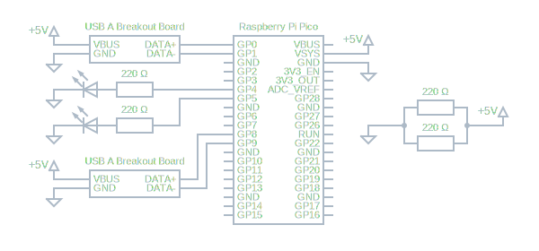

# SI-Printer

SI-Printer is a simple system that aims to reduce complexity and hassle when
using the [SPORTident](https://www.sportident.com/) timing system during 
orienteering practice sessions.

SI-Printer allows a reader station to be connected directly to a thermal 
printer without the use of an android phone with bluetooth or similar. The 
entire system may be powered using a conventional USB power bank.

## SPORTident Device Support

The system has been successfully verified with the following devices.

| **Readers** | **USB VID** | **USB PID** |
|---|---|---|
| BSM 8-USB | `0x10C4` | `0x800A` |

| **Printers** | **USB VID** | **USB PID** |
|---|---|---|
| Miniprinter | `0x0416` | `0x5011` |

As for cards, they *should* all work. Validated ones are listed here.

| **Card Model** | **Validated Working** |
| --- | --- |
| SI-Card 5 | :heavy_check_mark: |
| SI-Card 6 | |
| SI-Card 8 | |
| SI-Card 9 | |
| SI-Card 10 | :heavy_check_mark: |
| SI-Card 11 | |
| SI pCard | |

## Materials

Here is a list of materials used to create a SI-Printer.

**TODO**

## Circuit Diagram

  

